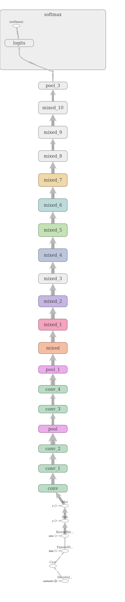

# inception_service
This repository contains implementation of a simple service which exposes REST API to infer feature vectors of input images with help of pretrained inception V3 model.

High level architecture of net used in this service is shown bellow:


More about the inception network and it's architecture here:

[Rethinking the Inception Architecture for Computer Vision](https://www.cv-foundation.org/openaccess/content_cvpr_2016/papers/Szegedy_Rethinking_the_Inception_CVPR_2016_paper.pdf)


## REST endpoints

The service exposes a single POST endpoint on port 8000. The post request must contain the image inference for which must be done.

Possible request/responses are shown bellow:
```
curl -i -X POST -H "Content-Type: multipart/form-data" -F "image=@/image_path/example.jpg"

Response:

HTTP 200
{
    "feature_vector":"[[1x2048 feature vector]]",
    "image_id":"example_image_id"
}
```

In case of error responses the Service responds with human friendly message and corresponding HTTP code.
Examples of error responses are shown bellow:

```
HTTP:400
{
    "error_message": "Possible problem is wrong request type."
}
```

```
HTTP:404
{
    "error_message":"Requested resource does not exist."
}

```


## Lets twist it a little bit

### Dependencies

* [Docker](https://www.docker.com/)


Running the service is as simple as:
```
git clone https://github.com/hbeybutyan/inseption_service.git
cd inseption_service
./run.sh
```

You are done! Enjoy it. The service is litening on port 8000 by default.
You can change the port by providing is to the run script as an argument like:
```
./run.sh 1234
```


For your convenience an example image is included in the repo itself. You can test the docker with it as:

```
curl -i -X POST -H "Content-Type: multipart/form-data" -F "image=@./resources/cropped_panda.jpg" 127.0.0.1:8000
```


